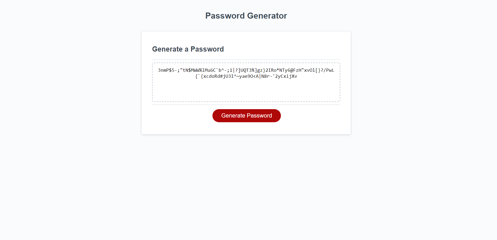

# Random Password Genearator

## Description 
This random password generator website prompts the user upon opening the site different variables they would like for their randomized password. You are given a series of questions about length, lowercase, uppercase, and symbols. Once the user answers these questions then they would click the "Generate Password" button. This will give the user a random password based on the selections they chose when answering the questions. The password will show up in the box provided. All of the prompts and random generator were done using java.scripts. 

  

## URL
https://jonnvoo.github.io/Random-password-gen/ 
